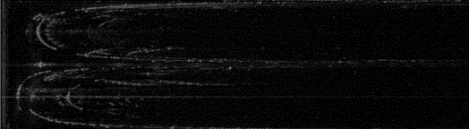
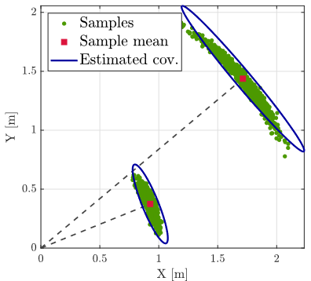
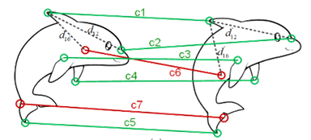
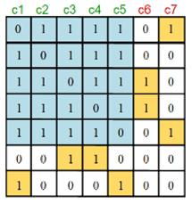

# 扫描毫米波雷达点云配准

> 本文讨论**适用于毫米波雷达数据的点云配准问题**。

## 扫描毫米波雷达测量模型

### 扫描毫米波雷达硬件参数特征

本文采用 Mulran 数据集，该数据集的主要目的是促进基于距离传感器的位置识别研究。为了实现这个目标，我们构建了一个传感器系统，所采用扫描毫米波雷达各项参数如下：

| Manufacturer |  Model   |             Description              |  Hz  | Range |
| :----------: | :------: | :----------------------------------: | :--: | :---: |
|   Navtech    | CIR204-H | 0.9° and 0.06 m resolution, 360° FOV |  4   | 200 m |

取数据集中扫描毫米波雷达原始数据如下：

_Mulran 数据集所提供的单帧扫描毫米波雷达数据（极坐标表示 $3360\times400$）_

应用广泛的 360° FMCW Radar 传感器输出的图像，沿高度和宽度方向的轴分别表示相对于传感器框架的**径向**和**切向**。

> 注意到径向方向的分辨率远远优于切向。
> {: .prompt-tip }

### 扫描毫米波雷达各向异性不确定性建模

与激光雷达测量的各向同性（即它们沿轴的方差可能相等）不确定性不同，扫描毫米波雷达测量具有各向异性特征，也就是说，沿方位角方向的每个点的不确定性相对较大，而沿径向方向的不确定性较小。为了建模雷达特征点的不确定性，测量噪声被表示为<u>沿着扫描毫米波雷达信号发射的方向的径向不确定性</u>和<u>垂直于径向方向的方位不确定性的叠加</u>。因此，不确定性呈现为香蕉形状（如下图所示）。

_扫描毫米波雷达雷达特征点各向异性特征的可视化描述_

于是，将点云中第 $k$ 个点以极坐标形式表示，即

$$\begin{equation}\boldsymbol p_k=\rho_k\begin{bmatrix}\cos\theta_k&\sin\theta_k\end{bmatrix}^T\tag{1}\end{equation}$$

其中，

$$\begin{equation}\rho_k=\rho_k^\circ+\delta\rho_k\tag{2}\end{equation}$$

$\delta\rho_k$ 表示径向测量的噪声项，服从 $\delta\rho_k\sim N(0,\sigma_{\rho_k}^2)$，$\sigma_{\rho_k}$ 表示其标准差；

$$\begin{equation}\begin{bmatrix}\cos\theta_k&\sin\theta_k\end{bmatrix}^T=\begin{bmatrix}\cos(\theta_k^\circ+\delta\theta_k)&\sin(\theta_k^\circ+\delta\theta_k)\end{bmatrix}^T\tag{3}\end{equation}$$

$\delta\theta_k$ 表示切向测量的噪声项，$\delta\theta_k\sim N(0,\sigma_{\theta_k}^2)$，$\sigma_{\theta_k}$ 表示其标准差，进一步讨论，

$$\begin{equation}\begin{aligned}\begin{bmatrix}\cos\theta_k&\sin\theta_k\end{bmatrix}^T&=\begin{bmatrix}\cos(\theta_k^\circ+\delta\theta_k)&\sin(\theta_k^\circ+\delta\theta_k)\end{bmatrix}^T\\
&=\begin{bmatrix}\cos\delta\theta_k&-\sin\delta\theta_k\\\sin\delta\theta_k&\cos\delta\theta_k\end{bmatrix}\begin{bmatrix}\cos\theta_k^\circ\\\sin\theta_k^\circ\end{bmatrix}\\
&=\begin{bmatrix}\cos\delta\theta_k&-\sin\delta\theta_k\\\sin\delta\theta_k&\cos\delta\theta_k\end{bmatrix}\begin{bmatrix}\cos\theta_k^\circ\\\sin\theta_k^\circ\end{bmatrix}\\
&\approx\bigg(\begin{bmatrix}1&0\\0&1\end{bmatrix}+\begin{bmatrix}0&-\delta\theta_k\\\delta\theta_k&0\end{bmatrix}\bigg)\begin{bmatrix}\cos\theta_k^\circ\\\sin\theta_k^\circ\end{bmatrix}\end{aligned}\tag{4}\end{equation}$$

因此，将 $(2)$ 和 $(4)$ 代入 $(1)$，则点云中第 $k$ 个点的不确定度可以表示为

$$\begin{equation}\begin{aligned}\boldsymbol p_k&=(\rho_k^\circ+\delta\rho_k)\bigg(\begin{bmatrix}1&0\\0&1\end{bmatrix}+\begin{bmatrix}0&-\delta\theta_k\\\delta\theta_k&0\end{bmatrix}\bigg)\begin{bmatrix}\cos\theta_k^\circ\\\sin\theta_k^\circ\end{bmatrix}\\
&=\boldsymbol p_k^\circ+\rho_k\begin{bmatrix}1&0\\0&1\end{bmatrix}\begin{bmatrix}\cos\theta_k^\circ\\\sin\theta_k^\circ\end{bmatrix}\delta\theta_k+\begin{bmatrix}\cos\theta_k\\\sin\theta_k\end{bmatrix}\delta\rho_k\\
&\approx \boldsymbol p_k^\circ+\rho_k\begin{bmatrix}1&0\\0&1\end{bmatrix}\begin{bmatrix}\cos\theta_k\\\sin\theta_k\end{bmatrix}\delta\theta_k+\begin{bmatrix}\cos\theta_k\\\sin\theta_k\end{bmatrix}\delta\rho_k\end{aligned}\tag{5}\end{equation}$$

即

$$\begin{equation}\delta \boldsymbol p_k=\rho_k\begin{bmatrix}1&0\\0&1\end{bmatrix}\begin{bmatrix}\cos\theta_k\\\sin\theta_k\end{bmatrix}\delta\theta_k+\begin{bmatrix}\cos\theta_k\\\sin\theta_k\end{bmatrix}\delta\rho_k\tag{6}\end{equation}$$

$\delta\boldsymbol p_k$ 表示点云中第 $k$ 个点坐标的噪声项，令 $C_{\boldsymbol p_k}$ 表示其协方差，则有

$$\begin{equation}C_{\boldsymbol p_k}=\rho_k^2\begin{bmatrix}\sin^2\theta_k&0\\0&\cos^2\theta_k\end{bmatrix}\delta_{\theta_k}^2+\begin{bmatrix}\cos^2\theta_k&\cos\theta_k\sin\theta_k\\\cos\theta_k\sin\theta_k&\sin^2\theta_k\end{bmatrix}\delta\rho_k^2\tag{7}\end{equation}$$

> 由径向和切向的分辨率，可估计 $\delta_{\theta_k}^2=(0.9°)^2/12,\delta_{\rho_k}^2=0.06^2/12$
{: .prompt-info }

## 缩放估计

我们可以简单地执行前文所描述的缩放、旋转和平移估计的级联。但对于缩放估计，由于 TIMs 能够与定义在三维点上的图的拓扑结构联系起来，可通过图论的解释进行离群值的剔除。

将 TRIMs 视为完全图 $G(V, E)$ 中的边（其中顶点 $V$ 是对应关系，边集 $E$ 诱导出 TIMs 和 TRIMs）。在估计了缩放之后（<u>对于扫描毫米波雷达测量来说，连续的两帧之间缩放为 1</u>），我们可以剔除图中的边 $(i,j)$，若与其关联的 TRIM $s_{ij}$ 被 $\bar c$ 分类为离群值（即，$|s_{ij} −\hat s|\geq \bar c$）。这使得我们获得一个修剪过的图 $G'(V, E')$，其中 $E' ⊆ E$​，剔除了显著的离群值。

可以被证明：内点 TIM 对应的边在 $E'$ 中形成一个团，且 $E'$ 中至少存在一个包含所有内点的极大团。因此，我们只需要从完全图 $G(V, E)$ 中搜索最大团（如图蓝色阴影部分），即可实现离群值的有效且快速地剔除。

## 旋转估计

